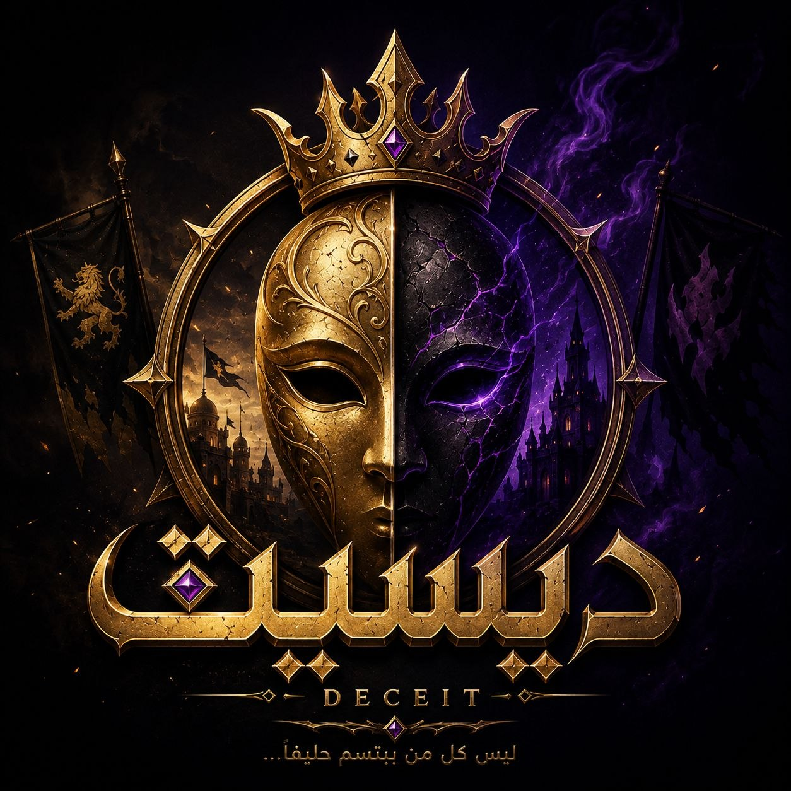

# 🏰 ديسيت — DECEIT ONLINE (Web Multiplayer)

<div align="center">



**لعبة الخداع والشكوك العربية المشهورة — النسخة الإلكترونية الجماعية**

[](https://www.typescriptlang.org/)
[](https://react.dev/)
[](https://socket.io/)
[](https://nodejs.org/)
[](https://vitejs.dev/)
[](https://tailwindcss.com/)

[نظرة عامة](#-نظرة-عامة-about) • [المميزات الرئيسية](#-المميزات-الرئيسية-features) • [فصائل وأدوار اللعبة](#-فصائل-وأدوار-اللعبة-roles) • [دليل التشغيل المحلي](#-دليل-التشغيل-المحلي-quick-start) • [هيكلية المشروع](#-هيكلية-المشروع-project-structure)

</div>

---

## 📜 نظرة عامة (About)

**ديسيت (Deceit Online)** هي النسخة الويب التفاعلية التنافسية من لعبة الخداع العربي الشهيرة **"ديسيت"**. تدور أحداث اللعبة في أروقة قلعة عربية قديمة، حيث يجتمع أبناء المملكة لحمايتها من شبح الظلال والمخادعين.

تعتمد اللعبة على **الخصائص السريعة، الاقتراع السري، والتفكير الاستراتيجي**. يوزع النظام الأدوار والفرق سرًا في بداية كل مباراة، مع توفير آليات لعب متقدمة ومؤثرات صوتية ومرئية عربية فاخرة.

---

## ✨ المميزات الرئيسية (Features)

### 👑 1. نظام شبكي وتزامن حي بالوقت الفعلي (Real-time WebSockets)
- تزامن فوري لجميع أحداث اللعبة عبر **Socket.IO** بين جميع اللاعبين والمتصفحات المتصلة.
- حفظ واستعادة جلسة اللاعب عند الانقطاع أو التحديث بفضل `Room Code` ونظام `reconnectPlayerId`.

### 🤖 2. بوتات ذكية متطورة (Intelligent AI Bots)
- إمكانية إضافة بوتات ذكية لتكملة عدد اللاعبين في حال عدم اكتمال العدد المطلوب (5 على الأقل).
- اتخاذ قرارات ليلية وتصويت منطقي مستند إلى معطيات ومجريات المعركة.

### 📜 3. معرض البطاقات والأدوار (Role Codex Gallery)
- موسوعة شريفة تضم **23 بطاقة دور** كاملة الرسم بالتفاصيل والأوصاف الرسمية للعبة الورقية.
- بطاقات ثلاثية الأبعاد (3D Flip) تتيح كشف وقراءة هويات الدور بخصوصية تامة مع تكبير العمل الفني PNG بدقة فائقة.

### ⚖️ 4. جولات الإعادة والتصويت المحسوم (Runoff Voting System)
- حسم حالات التعادل بتشغيل **جولة إعادة تلقائية (Runoff)** محصورة حصريًا بين المرشحين المتعادلين.
- إتاحة مرسوم اعتراض القاضي السري لإلغاء الأحكام غير العادلة وإعادة كفة العدالة.

### 🔊 5. جو ومؤثرات صوتية فاخرة (Rich Arabian Audio System)
- موسيقى خلفية تفاعلية (BGM) تتغير حسب مرحلة اللعبة (الرئيسية، توزيع الأدوار، ظلمات الليل، مجلس الشورى، والانتصار).
- مؤثرات صوتية (SFX) عند التقليب، الاقتراع، صوت ديك الصباح، جرس التنفيذ، وتنبيه عداد الوقت الأخير (10 ثوانٍ).

### 💬 6. دردشة جانبية وسجل أحداث آلي (Live Side Chat & System Events)
- لوحة دردشة مباشرة تتيح التواصل بين اللاعبين مع تبويب مخصص لأحداث النظام (`System Feed`) لتتبع حركات الليل واستباكات الاقتراع.

### 🎨 7. تصميم عربي فاخر وتأثيرات زجاجية (Dark Arabian Fantasy UI)
- خلفية متحركة تفاعلية تتضمن جسيمات مضيئة عائمة، زخارف عربية قديمة، خطوط عربية أصيلة (الكوفي، الأميري، والقاهرة)، وتأثيرات زجاجية راقية (Glassmorphism).

---

## 🎭 فصائل وأدوار اللعبة (Roles)

تتكون اللعبة من **23 دوراً فريداً** مقسمة على 3 فصائل رئيسية:

| الفصيل | الأيقونة | وصف الفصيل | أبرز الأدوار |
| :--- | :---: | :--- | :--- |
| **فريق المملكة** *(Kingdom)* | 👑 | يسعون لكشف الخونة وحماية الملك واستقرار القلعة. | الملك، ولي العهد، الحارس الملكي، الوزير، القاضي، الطبيب، العراف، الفارس، السياف، الزاجل، الحداد، العمدة |
| **فريق الظلال** *(Shadows)* | 🌑 | يعملون في الظلام لإسقاط العرش واغتيال الملك وحلفائه. | السفاح، المتنكر، المسمم، الساحر المظلم، الجاسوس، المخرب، الطيف |
| **المحايدون** *(Neutrals)* | 🃏 | لكل منهم هدف خاص منفرد لتحقيق الفوز المستقل. | المخادع، المهرج، الأبله، المنفي |

---

## 🛠️ التكنولوجيا المستخدمة (Tech Stack)

### Frontend (العميل)
- **Framework**: React 18 (TypeScript)
- **Build Tool**: Vite
- **Styling**: Vanilla CSS, TailwindCSS, Custom Glassmorphism & Keyframes
- **Icons**: Lucide React Icons
- **Audio Engine**: HTML5 Web Audio API Custom SoundManager

### Backend (الخادم)
- **Runtime**: Node.js & Express
- **Real-time Comms**: Socket.IO 4.8
- **Database**: MongoDB & Mongoose
- **Language**: TypeScript (Node-dev / ts-node)

### Shared Workspace (الحزمة المشتركة)
- **Type Definitions**: Shared Interfaces (Game Engine, Roles, Players, Socket Protocol)
- **Game Engine**: Server-Authoritative Logic & Hidden Projections

---

## 🚀 دليل التشغيل المحلي (Quick Start)

### المتطلبات المسبقة (Prerequisites)
- **Node.js** (v18.0.0 أو أحدث)
- **npm** (v9.0.0 أو أحدث)
- **MongoDB** (يعمل على `mongodb://localhost:27017/deceit` أو بيئة مجاورة)

---

### خطوات التشغيل (Installation Steps)

1. **استنساخ المستودع (Clone Repository)**:
   ```bash
   git clone https://github.com/0Kareem0/Deceit-Online--.git
   cd Deceit-Online--
   ```

2. **تثبيت التبعيات (Install Dependencies)**:
   ```bash
   npm install
   ```

3. **بناء الحزمة المشتركة (Build Shared Types)**:
   ```bash
   npm run build:shared
   ```

4. **تشغيل المشروع محلياً (Run Dev Servers)**:
   ```bash
   # تشغيل خادم التطبيق والواجهة معاً
   npm run dev
   ```
   *أو تشغيل كل منهما بشكل منفصل:*
   ```bash
   # خادم الخادم (Backend on http://localhost:3000)
   npm run dev:server

   # خادم الواجهة (Frontend on http://localhost:5173)
   npm run dev:client
   ```

5. **افتح اللعبة**:
   افتح المتصفح وانتقل إلى: `http://localhost:5173`

---

## 🧪 الاختبارات والبناء (Testing & Build Verification)

- **تشغيل وحدة اختبار قواعد وقوانين اللعبة**:
  ```bash
  npm run test:server
  ```

- **بناء النسخة الإنتاجية (Production Build)**:
  ```bash
  npm run build:client
  npm run build:server
  ```

---

## 📁 هيكلية المشروع (Project Structure)

```text
Deceit-Online--/
├── client/                     # تطبيق الواجهة الأمامية (React + Vite)
│   ├── public/                 # الصوتيات (MP3) والصور وبطاقات الأدوار (PNG/JPG)
│   ├── src/
│   │   ├── components/         # المكونات التفاعلية (RoleCard, Timer, ChatPanel, Navbar, ...)
│   │   ├── context/            # مزودات سياق الصوت (SoundContext) وشبكة Socket
│   │   ├── data/               # تعريفات الـ 23 دوراً موسوعياً (rolesData.ts)
│   │   ├── pages/              # صفحات المراحل (Home, Lobby, Night, Voting, Elimination, RoleCodex, ...)
│   │   └── services/           # مدير الصوت وتأثيرات الـ Web Audio (soundManager.ts)
├── server/                     # خادم اللعبة والمحرك الأساسي (Node.js + Socket.IO)
│   ├── src/
│   │   ├── db/                 # اتصالات قاعدة البيانات (MongoDB)
│   │   ├── game/               # محرك اللعبة، توزيع الأدوار، وحسم الليالي (GameEngine.ts)
│   │   └── socket/             # معالجات غرف اللعب والرسائل (RoomManager.ts)
└── shared/                     # الحزمة المشتركة الأنواع والتعريفات (TypeScript Interfaces)
```

---

## 🤝 المساهمة والتطوير (Contribution)

نرحب بكافة الاقتراحات والمساهمات لتطوير اللعبة! يمكنك فتح `Issue` أو إرسال `Pull Request`.

---

## 📄 الترخيص (License)

هذا المشروع مخصص للاستخدام التعليمي والتطوير المحلي. جميع الحقوق محفوظة لـ **DECEIT — ديسيت**.
